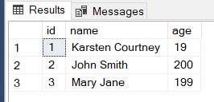

## Create a connection
In order to create a basic connection to a SQL Server all you have to do is
import and create a default object
```py linenums="1"
from nremc_database_connector import NremcDatabaseConnector
db = NremcDatabaseConnector()
```
This creates a Connection to a SQL server that is hosted on the same computer and attempts to find a database called master. It defaults to version 17 of the ODBC Driver.

## Create a connection from a config file
This library supports loading from a toml config file. For example if we had a local file called `config.toml` with the contents of
```lang-toml
[sql_server]
server = "TestServer"
database = "master"
version = 17

[sql_commands]
INSERT_DAILY = "SELECT * FROM logs;"
```
The header `[sql_server]` and its following variables establish the server and database to connect to and which version of the ODBC driver to use
The header `[sql_commands]` allows you to establish commands

We write the following code to load a Database Connection from the toml file
```py linenums="1"
from nremc_database_connector import NremcDatabaseConnector
db = NremcDatabaseConnector.from_toml_config("./config.toml")
```
Look at the [reference](reference.md) for further customization

## Adding a command
Once you have established a connection with the database and want to add commands you can call the function
```py linenums="1"
command_identifier = "SELECT_ALL"
command: str = "SELECT * FROM [table];
db.add_command(command_identifier, command)
```
This will add a command called `SELECT_ALL` which when called by the `call` method it will then execute the SQL command

## Executing a command
Once you have established a connection with the database and have your commands defined you can begin executing the commands
For example lets say we have a config file called `commands.toml` defined like this:
```lang-toml
[sql_server]
server = "TestBed1"
database = "PythonTest"
version = 17

[sql_commands]
SELECT_ALL_PEOPLE = "SELECT * FROM [dbo].[People]"
SELECT_PERSON_BY_ID = "SELECT * FROM [dbo].[People] WHERE [id] = ?"
UPDATE_AGE_BY_ID = "UPDATE [dbo].[People] set [name] = ?, [age] = ? WHERE [id] = ?"
```
and on a server called `TestBed1` in a database called `PythonTest` we have a table defined with some data like this on a table called `People`:
<br>


The `?` used in the sql commands is a placeholder for a argument that must be passed in

Finally we can call an sql command with the following code
```py linenums="1"
from nremc_database_connector import NremcDatabaseConnector
db = NremcDatabaseConnector.from_toml_config("./commands.toml")

db.call("SELECT_ALL_PEOPLE")
```
This will then call the predefined command in the toml file call `SELECT_ALL_PEOPLE` since the command does not have any `?` in its definition we don't need to pass any arguments

But if we call the command:
```py linenums="1"
db.call("SELECT_PERSON_BY_ID", 1)
```
We must provide one argument since in the definition of the command it has one `?`

If there are more than one arguments you can do the following

```py linenums="1"
db.call("UPDATE_AGE_BY_ID", "Jessica", 9, 1)
```
This will pass `"Jessica"` in to the first `?`, `9` into the second `?`, and `1` into the third `?`

## Executing a command many times over
If you want to execute the same command multiple times but with different values you can do
```py linenums="1"
new_names_and_ages = (("Larsten Courtney", 8, 1), 
                        ("Adam", 7, 2), 
                        ("Eve", 90, 3))
db.call_many("UPDATE_AGE_BY_ID", new_names_and_ages)
```
This will run the `UPDATE_AGE_BY_ID` three times since there are three sets of values

## Retrieving values after a SELECT query
If you run a command that retrieves data from the database you can do
```py linenums="1"
db.call("SELECT_PERSON_BY_ID", 1)
person = db.fetch() # person = (1, "Karsten Courtney", 19)
```
This returns a single pyodbc Row 

If you want to select multiple rows to return you can pass a number into `fetch` to fetch that many rows
```py linenums="1"
db.call("SELECT_ALL_PEOPLE")

two_people = db.fetch(2)
```

If you want to get all rows that were queried you can simply do
```py linenums="1"
db.call("SELECT_ALL_PEOPLE")

people = db.fetch_all()
```
This will return all queried information

## Committing and/pr rollback changes
If you run a command that INSERTS, UPDATES, or DELETES data you must either commit those changes to the database by calling
```py linenums="1"
db.commit()
```

or if you want to undo those changes or if theres an error you can rollback by calling
```py linenums="1"
db.rollback()
```
## Grabbing ahold of the Cursor
If you want to access the cursor to the database to read any additional information just do
```py linenums="1"
db.cursor
```
This will retrieve the cursor object connected to the database